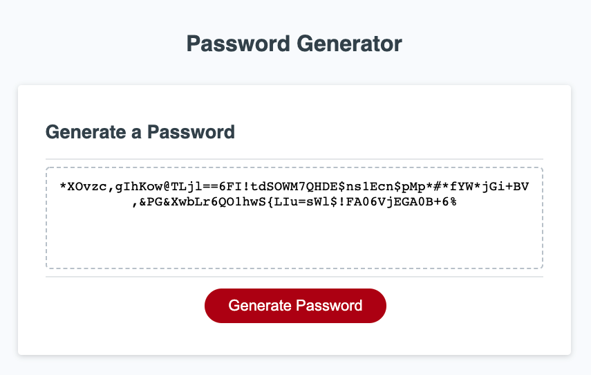

# Homework-03-Password Generator

## Task

This homework requires us to write javascript code for a password generator. This is the first time I've attempted to write a program in Javascript any more than simple excerisizes. I found it quite difficult to understand how functions and conditional statments work together. 

To me, this homework fell into two main problems to solve. (1) How to make a randomised password and (2) how to check if the password has at least one character of every type selected. If I was to rewrite this program, I would try and think of a way that generates the program to include at least one character from each character type from the start, so there would be no need to check the characters.

The task is as follows:

## User Story

```
AS AN employee with access to sensitive data
I WANT to randomly generate a password that meets certain criteria
SO THAT I can create a strong password that provides greater security
```

## Acceptance Criteria

```
GIVEN I need a new, secure password
WHEN I click the button to generate a password
THEN I am presented with a series of prompts for password criteria
WHEN prompted for password criteria
THEN I select which criteria to include in the password
WHEN prompted for the length of the password
THEN I choose a length of at least 8 characters and no more than 128 characters
WHEN asked for character types to include in the password
THEN I confirm whether or not to include lowercase, uppercase, numeric, and/or special characters
WHEN I answer each prompt
THEN my input should be validated and at least one character type should be selected
WHEN all prompts are answered
THEN a password is generated that matches the selected criteria
WHEN the password is generated
THEN the password is either displayed in an alert or written to the page
```

## Deployed Application

### Link:

[Homework 03 - Password Generator - Clayton McIntosh](https://claytonmcintosh.github.io/Homework-03-Password-Generator/Develop/index.html)

## Screenshot of Application


